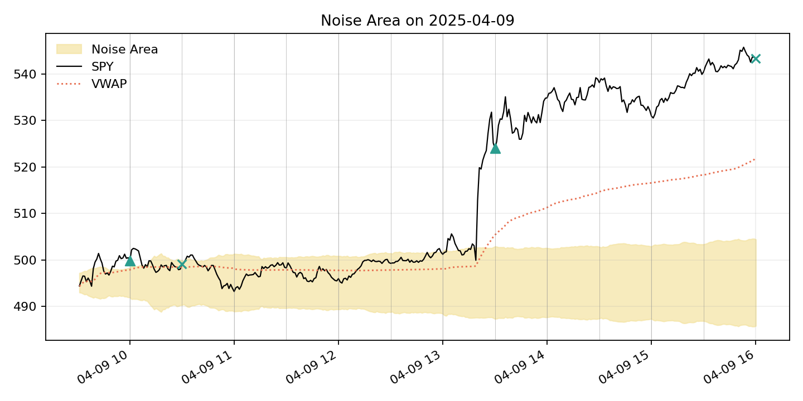
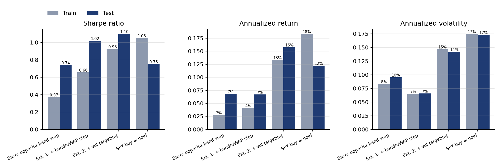
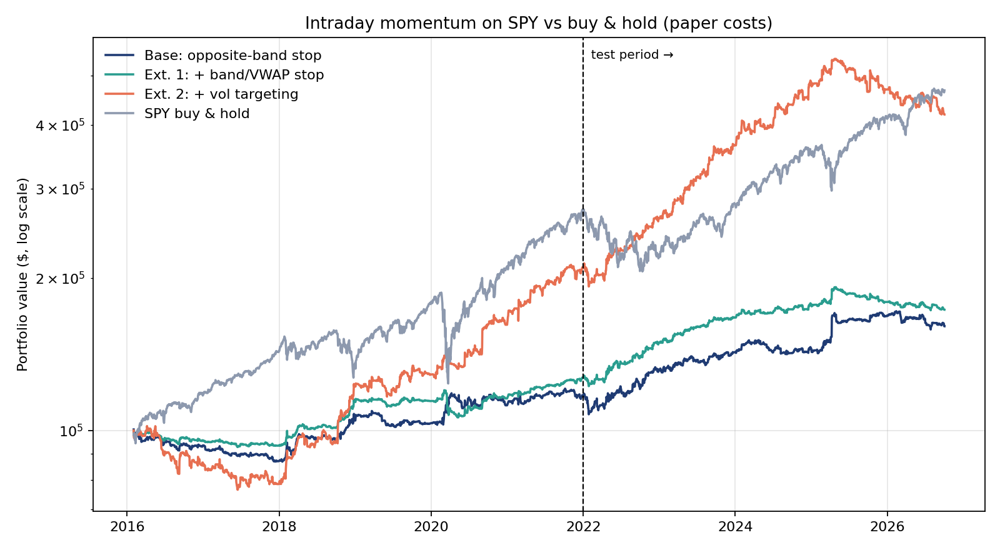
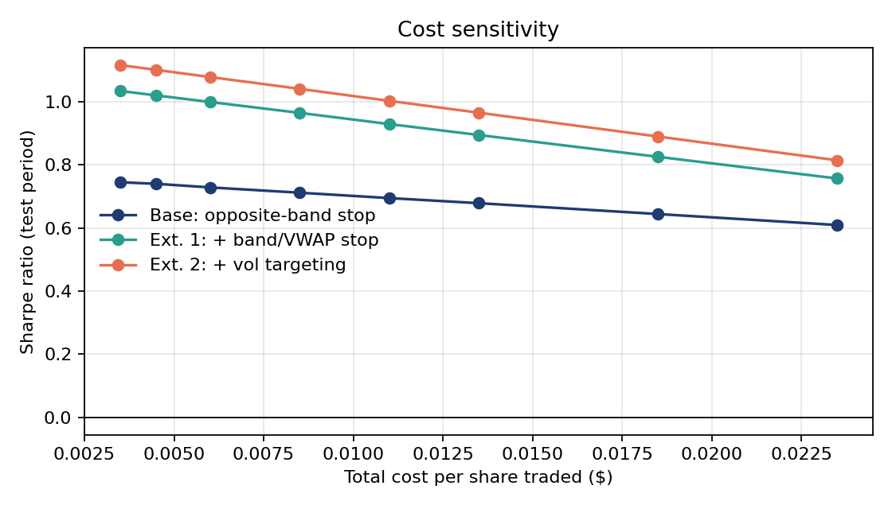
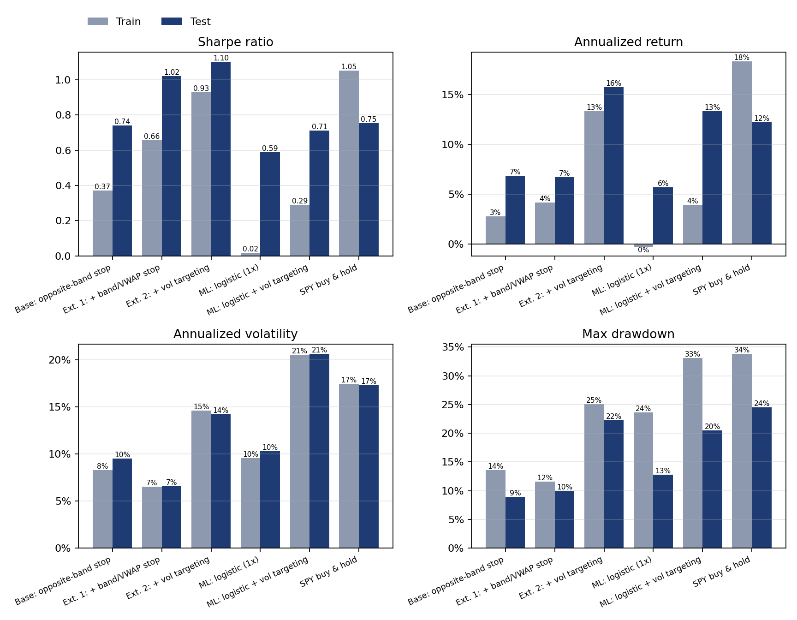
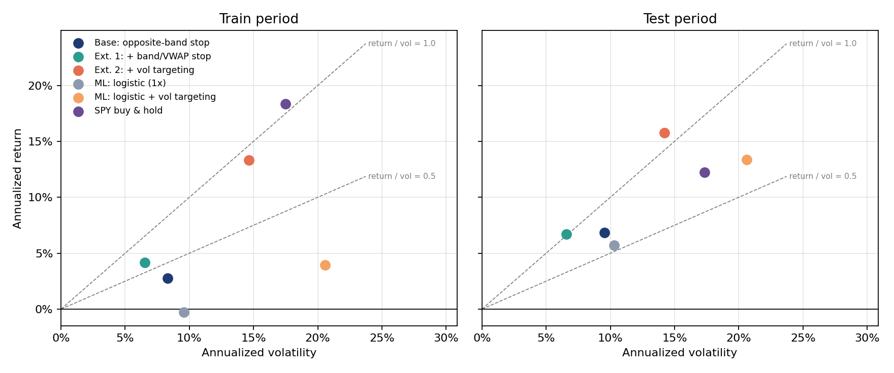
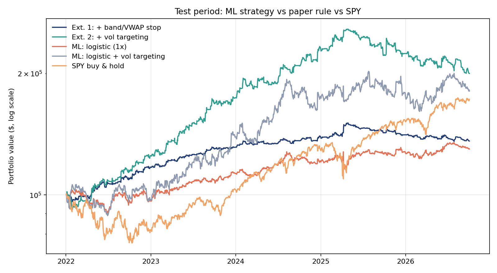

# Results and Discussion

*Mathematical specification: [`strategy.md`](strategy.md) · Own strategy: [`extensions.md`](extensions.md) · Code: [`src/intraday_momentum/`](../src/intraday_momentum)*

SPY 1-minute data, 2016-01 – 2026-10. Train period 2016–2021, test period 2022-01-03 – 2026-10-02. All numbers are after costs (commission max(\$0.35, \$0.0035 per share) per order plus \$0.001 slippage per share). The figures and tables are written to [`results/`](../results) by `scripts/run_backtest.py`, `scripts/run_ml.py` and the notebook.

---

## 1. The paper in brief

| | |
|---|---|
| **Core hypothesis** | Intraday trends come from persistent supply/demand imbalances. If the move from the open is abnormally large for the time of day, it tends to continue (time-series momentum). |
| **Signal** | Noise Area = average absolute move from the open at each minute over the last 14 days, anchored at max/min(open, previous close). Long above the upper band, short below the lower band. |
| **Execution** | Decisions only at HH:00 / HH:30 from 10:00, flat at the close, \$0.0035/share commission + \$0.001 slippage. |
| **Risk controls** | (1) Trailing stop at max(UB, VWAP) / min(LB, VWAP). (2) Volatility targeting: 2% daily, leverage ≤ 4. (3) No overnight positions. |
| **Why it may work** | Under-reaction to news (disposition effect, limited attention, slow-moving capital). Order flow of institutions executing over the day. Dealer delta-hedging when gamma is short amplifies moves. Positive skew from cut losers and held winners. |
| **When it fails** | Quiet, range-bound markets (many false breakouts, e.g. 2016–17). Sharp V-shaped reversals (news; March 2020; April 2025). Long dealer gamma (damped trends). Costs above ~\$0.03/share. Crowding and a decaying edge after publication. |

**Reading the figure.** The shaded band is the Noise Area, the black line is SPY, the dotted line is VWAP, and the vertical lines are the decision times. Triangles mark entries and crosses mark exits of Ext. 1.

- At 10:00 the price is above the upper band and above VWAP, so the strategy goes long. By 10:30 the price is back inside the band and the position is closed with a small loss. This is a **false breakout**, the strategy's typical losing trade.
- Until 13:30 there is no further signal, so there is no position.
- At 13:30 the price is far above the band. The strategy goes long and holds until the close, because the price never falls back below max(upper band, VWAP). This is the typical winning trade: rare, but large.
- The band widens during the day, because the average move from the open grows with time. A given move is therefore a stronger signal early in the day than late in the day.

---

## 2. Comparison with the authors' reference code

The authors publish a Python version of their backtest on [concretumgroup.com](https://www.concretumgroup.com/python-backtesting-beat-the-market-an-effective-intraday-momentum-strategy-for-the-sp500-etf-spy/), linked in the paper's FAQ (Q1). This repository is an independent implementation from the paper text. The table compares the two.

| Aspect | Reference code | This repository | Comparison |
|---|---|---|---|
| Noise Area σ | 14-day rolling mean of \|close/open − 1\| per minute (min. 13 obs.), shifted one day | same (min. 12 obs.) | identical logic |
| Bands | `max(open, prev_close_adj)·(1+VM·σ)`, `min(...)·(1−VM·σ)` | same | identical |
| Dividend adjustment of the previous close | `prev_close − dividend` on the ex-date | same | identical |
| Signal | long if close > UB **and** > VWAP. Short if close < LB **and** < VWAP. Else flat. | same (`stop="band_vwap"`) | identical |
| Decision times | `min_from_open % 30 == 0`, which uses the 09:59 bar at "10:00" | column 29 = 09:59 bar | identical |
| Commission | `max($0.35, 0.0035·q)` per order, a reversal counts as 2 orders | same | identical |
| Execution | entry at the close of the decision bar | entry at the open of the next bar | almost the same price, slightly stricter here |
| Share rounding | `round()` | `floor()` | minor. `floor` never exceeds the available capital. |
| Vol targeting | `min(4, 0.02 / vol)`, volatility over **15** days | **14** days, as stated in the paper | this repository follows the paper text |
| Slippage | **none** | \$0.001 per share, as stated in the paper | this repository follows the paper text |
| Sample | about 2 years, no split | 2016–2026, train/test split | longer sample, out-of-sample test |

**Findings**

1. The core logic (σ, bands, VWAP condition, decision times, commission) is identical.
2. The reference code applies **no slippage**, although the paper states \$0.001 per share. Results from the reference code are therefore slightly optimistic. This repository applies the paper's \$0.001.
3. Where the paper text and the reference code disagree (volatility window of 14 vs. 15 days), this repository follows the paper text.

---

## 3. Replication check against the paper

Yearly returns of the full model (Ext. 2) compared with the paper's monthly table (FAQ Q4/Q24):

| Year | 2016 | 2017 | 2018 | 2019 | 2020 | 2021 | 2022 | 2023 | 2024 |
|---|---|---|---|---|---|---|---|---|---|
| This repository | −13.4% | −9.3% | 55.6% | 5.7% | 25.3% | 29.7% | 25.1% | 39.2% | 32.6% |
| Paper | −12.8% | −6.9% | 61.1% | 6.9% | 26.8% | 34.8% | 24.4% | 37.2% | 32.2% |

The **correlation is 0.99**. Volatility (14.2–14.6% vs. 14.3%), max drawdown (22–25% vs. 25%), hit ratio (42–46% vs. 43%) and the positive skew also match. The 0.86–0.92 round trips per day correspond to the paper's ~1.8 orders per day.

---

## 4. Paper variants: train vs. test

| Strategy | Sharpe train | Sharpe test | Ann. return test | Ann. vol test | Max DD test |
|---|---|---|---|---|---|
| Base: opposite-band stop | 0.37 | 0.74 | 6.8% | 9.5% | 8.9% |
| Ext. 1: + band/VWAP stop | 0.66 | 1.02 | 6.7% | 6.6% | 10.0% |
| Ext. 2: + vol targeting | 0.93 | 1.10 | 15.8% | 14.2% | 22.3% |
| SPY buy & hold | 1.05 | 0.75 | 12.2% | 17.3% | 24.5% |

**Reading the figure.**

- **Sharpe ratio (left).** The ranking Base < Ext. 1 < Ext. 2 holds in both periods. Each of the paper's two refinements adds risk-adjusted return, also out of sample.
- **No drop from train to test.** The test Sharpe ratios are higher than the train Sharpe ratios. All parameters come from the paper, so nothing was fitted on this data. The 2022 bear market, with high volatility and strong trends, helps the test period.
- **Annualized return (middle) and volatility (right).** The band/VWAP stop (Ext. 1) leaves the return about unchanged but lowers the volatility from 9.5% to 6.6% in the test period. That is why its Sharpe ratio is higher. Vol targeting (Ext. 2) roughly doubles both return and volatility, so its Sharpe ratio rises only from 1.02 to 1.10.
- **Leverage, not edge.** The average leverage of Ext. 2 is about 2.7x, and the 4x cap binds on about 22% of days. Strategies should be compared by Sharpe ratio, not by return.
- **Against SPY.** SPY has the higher Sharpe ratio in the train period (1.05), and Ext. 1 and Ext. 2 have the higher one in the test period.

**Reading the figure.** The axis is logarithmic, so equal slopes mean equal growth rates. The dashed line marks the start of the test period.

- **2016–2017:** all variants lose money. The market is calm and range-bound, breakouts are rare and often false. Ext. 2 loses most because the low volatility leads to high leverage.
- **2018, 2020 and 2022:** the strategy gains in volatile, trending phases. In 2022 it rises while SPY falls, because it can be short and holds nothing overnight.
- **2022 to spring 2025:** steady gains for Ext. 1 and Ext. 2.
- **From spring 2025:** Ext. 1 and Ext. 2 drift down while SPY keeps rising. Section 7 looks at this period separately.
- Over the full sample Ext. 2 and SPY end at a similar level, but they get there in different years. That is the diversification argument for the strategy.

---

## 5. Cost sensitivity

**Reading the figure.** The horizontal axis is the total cost per share (commission plus slippage). The leftmost point is commission only, the second point (\$0.0045) is the cost assumption used everywhere else.

| Cost per share | Base | Ext. 1 | Ext. 2 |
|---|---|---|---|
| \$0.0045 (paper) | 0.74 | 1.02 | 1.10 |
| \$0.0085 (half of a 1-cent spread as slippage) | 0.71 | 0.96 | 1.04 |
| \$0.0235 | 0.61 | 0.76 | 0.81 |

- The Sharpe ratio falls roughly linearly with costs, and it stays clearly positive even at five times the paper's assumption.
- The lines of Ext. 1 and Ext. 2 are steeper than the line of the base version, because the tighter stop trades more often (0.92 vs. 0.65 round trips per day in the test period).
- The ranking of the three variants does not change over the whole range.

---

## 6. All implementations side by side

Own strategy: a logistic regression on seven paper-inspired features predicts the probability that the price rises until the close. The position is long, short or flat. Execution, costs and sizing are identical to the paper variants (design in [`extensions.md`](extensions.md)).

**Reading the figure.**

- **Sharpe ratio.** In the test period the ML strategy reaches 0.59 (1x) and 0.71 (with vol targeting). That is positive, but below the paper rule (1.02 and 1.10) and slightly below SPY (0.75).
- **Train bars of the ML strategy are in-sample**, because the model is fitted on the train period. Its train Sharpe ratio is still only 0.02. A model that had memorised the training data would show the opposite pattern (high in-sample, low out-of-sample). The strong regularisation chosen by cross-validation keeps the model simple.
- **Volatility.** At 1x the ML strategy has a volatility of 10%, compared with 7% for Ext. 1. It is in the market more often (long 45% and short 17% of the decision times) and has no stop that cuts losers early.
- **Max drawdown.** Vol targeting roughly doubles the drawdown of both the rule and the ML strategy. In the test period every strategy has a smaller drawdown than SPY.

**Reading the figure.** Each point is one implementation. Points on the same dashed line have the same return per unit of risk. Leverage moves a strategy outward along its line, and only a better signal moves it to a steeper line.

- **Test period (right).** Ext. 1 and Ext. 2 lie on almost the same line (return ≈ volatility). Vol targeting moved the strategy outward, not upward. The two ML points lie on flatter lines, between 0.5 and 1.
- The base version and the ML strategy (1x) have a similar return to Ext. 1 but more volatility, so they lie to its right.
- **Train period (left).** SPY lies on the steepest line, which reflects the strong bull market of 2016–2021.

**Reading the figure.**

- **2022:** SPY loses about 25% at its low. The rule rises, and the ML strategy ends the year about flat.
- **2022–2024:** the rule (Ext. 1, Ext. 2) grows steadily. The ML strategy grows more slowly and with larger swings.
- **From spring 2025:** the rule declines, while the ML strategy moves sideways to slightly up.
- The curves of the rule and the ML strategy do not move together. The correlation of their daily returns in the test period is −0.03.

---

## 7. Before and after the paper's publication

The paper was published in May 2024. The test period is split at that date.

| | Period | Ann. return | Sharpe |
|---|---|---|---|
| Ext. 1 (paper rule) | 2022-01 – 2024-04 | 14.2% | 1.86 |
| | 2024-05 – 2026-10 | 0.0% | 0.03 |
| ML (1x) | 2022-01 – 2024-04 | 6.6% | 0.67 |
| | 2024-05 – 2026-10 | 4.8% | 0.51 |
| SPY buy & hold | 2022-01 – 2024-04 | 3.9% | 0.30 |
| | 2024-05 – 2026-10 | 20.8% | 1.26 |

- The whole out-of-sample result of the paper rule comes from the time before publication. After publication its Sharpe ratio is about 0.
- Two explanations are possible: the edge has been traded away (crowding), or the period was a calm, steadily rising market in which intraday trends are weak. With 2.4 years of data the two cannot be separated statistically.
- The ML strategy keeps a Sharpe ratio of 0.51 after publication. Together with the near-zero correlation, this makes a combination of rule and ML model the most promising improvement.

---

## 8. Conclusions

1. **Replication.** The implementation reproduces the paper: yearly returns correlate 0.99 with the paper's table.
2. **Out of sample.** With the paper's parameters the strategy keeps a Sharpe ratio of 1.0–1.1 in 2022–2026, and the ranking of the variants is the same as in the paper.
3. **Costs.** The result is robust to much higher costs.
4. **Vol targeting is mostly leverage.** It doubles return and risk and adds little Sharpe ratio.
5. **After publication** the rule earns nothing. This is the main caveat.
6. **Own strategy.** The ML model has a small out-of-sample edge (test AUC 0.518). It does not beat the rule over the full test period, but it is uncorrelated with the rule and holds up better after publication.

## 9. Limitations

- **Financing and borrowing costs are not modelled.** This affects leverage up to 4x and short positions.
- **Test period length.** With about 4.75 test years, t ≈ Sharpe · √years, so a Sharpe ratio of 1 gives t ≈ 2.2. That is only borderline significant.
- **Regime dependence.** The strategy earns in volatile, trending markets and loses in quiet, range-bound ones.
- **Multiple testing.** Every additional variant tested increases the chance of a lucky result. The test period is therefore evaluated only once per variant.
